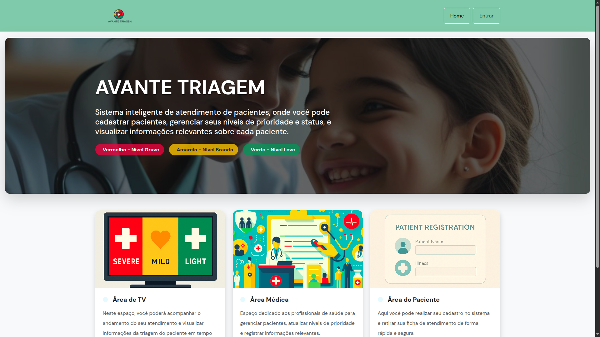

#  Atendimento de pacientes 
## Descrição do Projeto

Este projeto consiste em um sistema de triagem hospitalar desenvolvido para gerenciar o fluxo de pacientes. O sistema classifica os pacientes de acordo com a prioridade de atendimento, baseada na gravidade de sua condição, utilizando um esquema de cores para fácil identificação:

- 🔴 **Vermelho**: Nível grave, prioridade máxima.
- 🟡 **Amarelo**: Nível brando, prioridade média.
- 🟢 **Verde**: Nível leve, prioridade baixa.

O objetivo é otimizar o processo de atendimento, garantindo que pacientes em estado mais crítico recebam atenção imediata.
## Referências
Atividade proposta pelo projeto Capacita Brasil Residência em Tic, junto à Escola Atlântico Avanti e professor Eliakim Gama

 - [PDF_Frotend](https://drive.google.com/file/d/16lfgzZ3nFDGI2Yfpvto4s4vCX-ziEpI6/view?usp=sharing)
 - [PDF_Backend](https://drive.google.com/file/d/12EkACfmujZw6SvMb5XdofhQGVSNqaPhS/view?usp=sharing)
 - [Capacita Brasil](https://capacitabrasil.ifce.edu.br/)

<p align="center">
  
  
  
</p>




## Deploy

O projeto está atualmente disponível em [https://frontend-ckkn.onrender.com](https://frontend-ckkn.onrender.com/).

- **Para ter acesso pelo longin use:**

    ```bash
    email:Ingreddoutora@gmail.com
    password:aaaasa
    ```
## 🤝 Colaboradores

Equipe 4

<table>
  <tr>
    <td align="center">
      <a href="#" title="defina o titulo do link">
        <br>
        <sub><b>Ingrid Oliveira</b></sub>
      </a>
    </td>
    <td align="center">
      <a href="#" title="defina o titulo do link">
        <br>
        <sub><b>Xênia Beatriz
 </b></sub>
      </a>
    </td>
    <td align="center">
      <a href="#" title="defina o titulo do link">
        <br>
        <sub><b>Carol</b></sub>
      </a>
    </td>
  </tr>
</table>

