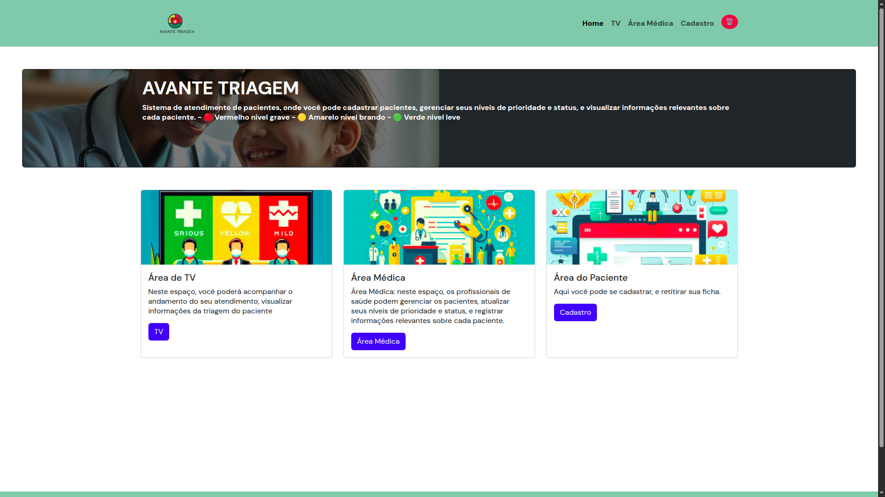

#  Atendimento de pacientes 

## - Um sistema de triagem hospitalar  

  
  
  

## 🤝 Colaboradores

Equipe 4

<table>
  <tr>
    <td align="center">
      <a href="#" title="defina o titulo do link">
         
        <b>Ingrid Oliveira</b>
      </a>
    </td>
    <td align="center">
      <a href="#" title="defina o titulo do link">
         
        <b>Xênia Beatriz
 </b>
      </a>
    </td>
    <td align="center">
      <a href="#" title="defina o titulo do link">
         
        <b>Carol</b>
      </a>
    </td>
  </tr>
</table>

